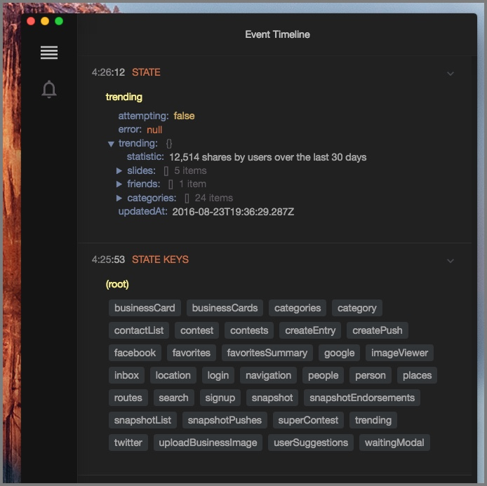
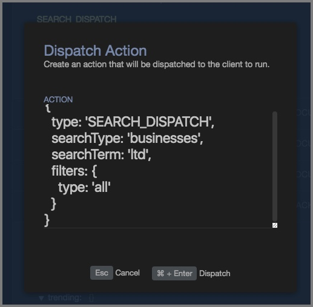

# reactotron-redux

[Redux](http://redux.js.org/) is library for managing global state.  It's pretty damn awesome.

And everyone knows when you combine two great things, you get a super-awesome thing.  Except for toothpaste & orange juice.  Keep those separate.






# Installing

`reactotron-redux` is a plugin which lives in a different npm package.  You can install it by typing:

```
npm install --save-dev reactotron-redux
```

# Features

* track when actions are dispatch including timing
* subscribe to changes within the state tree
* pull values out on demand
* view list of keys
* dispatch actions from Reactotron
* replay actions
* hot swap your app state on the fly


# Installing

`npm i --save-dev reactotron-redux`


# Configuring

Two files need to change to hookup Reactotron to Redux.  First, in your
ReactotronConfig, you'll need to add `reactotron-redux` as plugin

```js

// ReactotronConfig.js
import { reactotronRedux } from 'reactotron-redux'


// then add it to the plugin list
Reactotron
  .configure({ name: 'React Native Demo' })
  .use(reactotronRedux()) //  <- here i am!
```

Then, where you create your Redux store, instead of using Redux's `createStore`,
you can use Reactotron's `createStore` which has the same interface.


```js
const store = Reactotron.createStore(rootReducer, compose(middleware))
```

# Options

`reactotronRedux()` accepts an optional parameter which is an object you can use
ton configure

#### except

`except` is an array of strings that match actions flowing through Redux.

If you have some actions you'd rather just not see (for example, `redux-saga`)
triggers a little bit of noise, you can suppress them:

```js
reactotronRedux({
  except: ['EFFECT_TRIGGERED', 'EFFECT_RESOLVED', 'EFFECT_REJECTED']
})
```

#### isActionImportant

`isActionImportant` is a function which receives and action and returns a boolean.
`true` will be cause the action to show up in the Reactotron app with a highlight.

```js
reactotronRedux({
  isActionImportant: action => action.type === 'repo.receive'
})
```

#### onBackup

`onBackup` fires when we're about to transfer a copy of your Redux global state
tree and send it to the server.  It accepts a object called `state` and returns
an object called `state`.

You can use this to prevent big, sensitive, or transient data from going to
Reactotron.

#### onRestore

`onRestore` is the opposite of `onBackup`.  It will fire when the Reactotron app
sends a new copy of state to the app.
